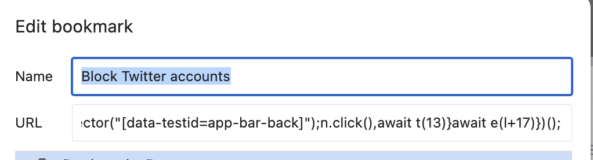

# twitter-blocking-assistant
  - This is a Google Chrome Extension, but it cannot be used as an extension any more.

# features
  - Blocking all the twitter(X) accounts of follower list.(Due to twitter(X) follower list's bug, this feature doesn't work.)
  - Blocking all the twitter(X) accounts of like list for a single tweet.
  - Blocking all the twitter(X) accounts of retweeting list for a single tweet.

# How to use BookMark executing the javascript
  - Create a new bookmark in Google Chrome
  - Edit the bookmark and replace the url to javascript code

# Minified code as follows:
```javascript
javascript:(async()=>{async function e(e){await new Promise(t=>setTimeout(t,100*e))}async function t(e){return new Promise(t=>{window.scrollBy(0,90*e),setTimeout(()=>{console.log("Finished scrolling, executing other code now."),t()},1e3)})}async function l(){let l=document.querySelectorAll('div[data-testid="cellInnerDiv"] div[data-testid=UserCell]'),i=l.length;console.log(i);let a=0;for(let c=0;c<i;c++){let o=document.querySelectorAll('div[data-testid="cellInnerDiv"] div[data-testid=UserCell]');if(!o[c])continue;{let n=o[c].querySelector('div[data-testid$="-unblock"]');if(n)continue;o[c].click(),a++}await e(13);let r=document.querySelector("div[data-testid$='-unblock']");if(!r){let d=document.querySelector("[data-testid=userActions]");d&&d.click(),await e(14);let s=document.querySelector("[data-testid=block]");s&&s.click(),await e(15);let u=document.querySelector("[data-testid=confirmationSheetConfirm]");u&&u.click()}await e(14);let $=document.querySelector("[data-testid=app-bar-back]");$&&$.click(),await e(13)}return setTimeout(()=>{console.log("Finished blocking, executing other code now.")},2e3*i),await t(i),a}let i=0;for(let a=0;a<10;a++){let c=await l();i+=c,console.log(`autoBlocked run ${a+1} completed.`),console.log(`autoBlocked total  ${i} users.`)}})();
```

# The screenshot is as follows:

